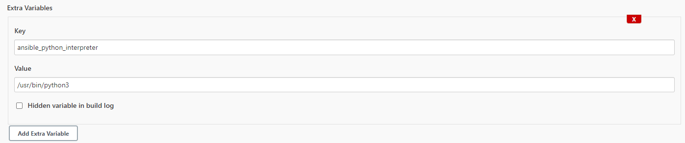
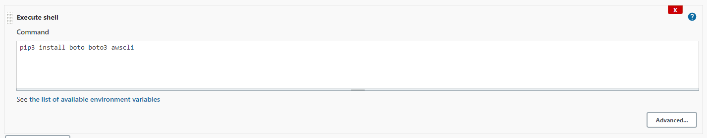
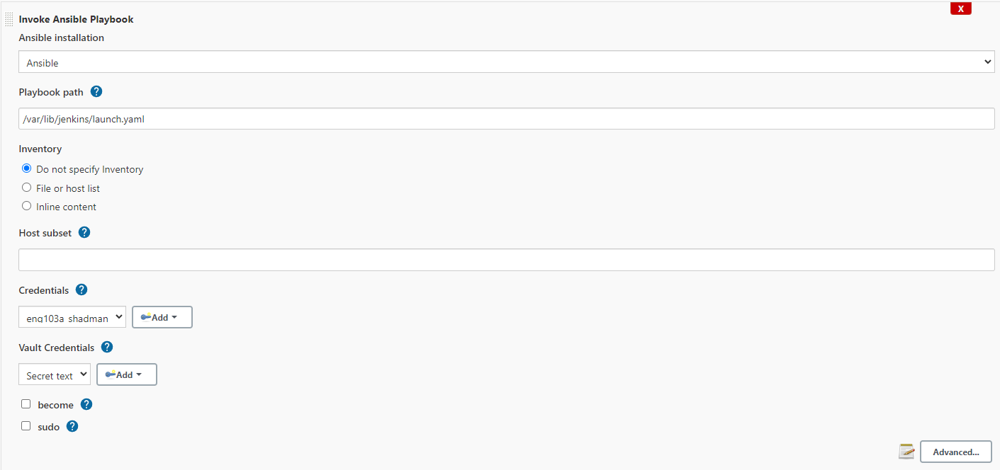
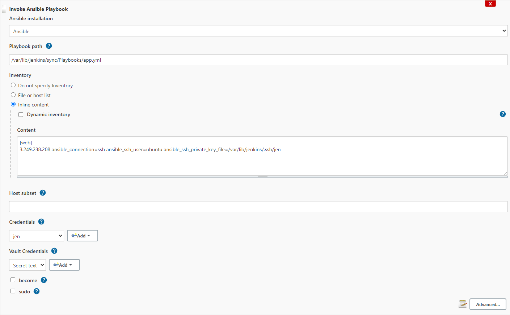

# Running Ansible Playbooks in Jenkins

## Setting up
- install `Ansible` Plugin and set it up under `Global Tool Configuration` with `/usr/bin/` as the path.
- install `Ansible` and `python3-pip` in Jenkins server.
- change user to `jenkins`, and install the following `pip3` packages: `boto` `boto3` `awscli`.
- staying as `jenkins` user, create ssh keys in `.ssh` in the jenkins folder.
- staying as `jenkins` user, create an `Ansible-Vault` with the `AWS Keys`.
- change paths of your Playbooks appropriately.

## Jenkins Jobs

Ensure that all the Jobs involving Ansible Playbooks has an `Extra Variable` to user `Python3` under `Advanced...` options.

>### First Job

The first Job is for provisioning 3 EC2 instances; An web and db VM, and a controller VM.

>### Second Job

In here we will install Ansible, and its dependencies on the controller VM.

>### Third Job

This job would be to install mongodb and change configuration, so the web VM can connect without any issues.

>### Fourth Job

This is the last job where it would install all dependency for our app in the web VM, as well as connect it to the db VM and lastly start our app so its accessible from the web.

